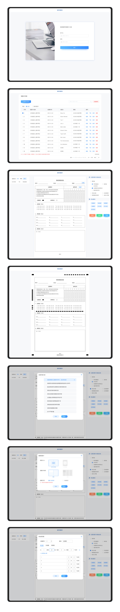

<!--
 * @CreateDate: 2023-08-21 13:41:14
 * @LastEditors: xianzhiding xianzhiding@qq.com
 * @LastEditTime: 2023-08-21 14:34:58
 * @FilePath: \w3cbest.github.iod:\Application\frontend\answer-sheet\README.md
-->
# answer-project

## Project setup
```
npm install
```

### Compiles and hot-reloads for development
```
npm run serve
```

### Compiles and minifies for production
```
npm run build
```

### Lints and fixes files
```
npm run lint
```

### Customize configuration
See [Configuration Reference](https://cli.vuejs.org/config/).

### Page
